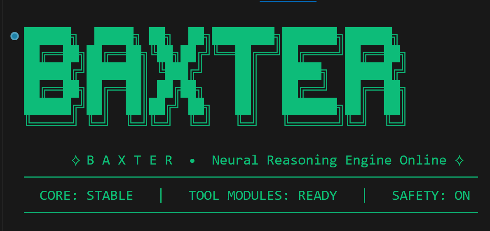

# Terminal Coding Agent (Baxter CLI)



A lightweight CLI coding assistant with a provider-agnostic model layer and a local tool registry to safely read and write files, run restricted terminal commands, and perform constrained Git operations.

## Features

- Interactive terminal chat loop
- Provider-agnostic model integration (`groq`, `openai`, `anthropic`)
- Session settings via `/settings` (provider/model switching)
- Structured tool calling with chained tool steps
- Local tools:
  - `read_file`
  - `write_file`
  - `list_dir`
  - `make_dir`
  - `delete_path`
  - `run_cmd`
  - `git_cmd`
  - `search_code`
- Safety protections:
  - Relative-path-only file access
  - Path traversal and root-escape prevention
  - No shell execution for command tools
  - Command and Git allowlists
  - Timeouts on tool execution

## Project Layout

```text
.
├─ .env.example
├─ pyproject.toml
├─ README.md
└─ baxter/
   ├─ __init__.py
   ├─ baxter_cli.py
   ├─ providers.py
   └─ tools/
      ├─ registry.py
      ├─ safe_path.py
      ├─ read_file.py
      ├─ write_file.py
      ├─ list_dir.py
      ├─ make_dir.py
      ├─ delete_path.py
      ├─ run_cmd.py
      ├─ git_cmd.py
      └─ search_code.py
```

## Requirements

- Python 3.10+
- At least one provider API key (`GROQ_API_KEY`, `OPENAI_API_KEY`, `ANTHROPIC_API_KEY`)

## Setup

1. Create and activate a virtual environment (recommended).

Windows (cmd):

```bat
python -m venv .venv
.venv\Scripts\activate.bat
```

Windows (PowerShell):

```powershell
python -m venv .venv
.venv\Scripts\Activate.ps1
```

macOS/Linux:

```bash
python3 -m venv .venv
source .venv/bin/activate
```

2. Install the package in editable mode:

```bash
pip install -e .
```

3. Configure environment variables by creating `.env` from `.env.example`, then set:

```env
GROQ_API_KEY=your_real_key_here
OPENAI_API_KEY=your_real_key_here
ANTHROPIC_API_KEY=your_real_key_here
```

## Run

Use either entrypoint:

```bash
baxter
```

or:

```bash
python -m baxter.baxter_cli
```

On startup, the CLI prints API key availability for each provider and enters interactive mode.

Settings commands:

- `/settings`
- `/settings provider <groq|openai|anthropic>`
- `/settings model <model_name>`
- `/settings reset-model`

## Tool Call Format

When the model chooses a tool, it must return exactly one JSON object:

```json
{"tool":"read_file","args":{"path":"README.md"}}
```

Tool results are fed back into the conversation. Chaining continues until the model returns normal text.

## Command Safety Model

`run_cmd` allowlist:

- `python`
- `python3`
- `pip`
- `pip3`
- `git`

`git_cmd` subcommand allowlist:

- `status`
- `log`
- `diff`
- `show`
- `branch`
- `switch`
- `checkout`
- `add`
- `commit`
- `push`
- `pull`
- `fetch`
- `remote`
- `rev-parse`
- `restore`
- `rm`
- `mv`
- `stash`

Additional protections:

- Disallows shell usage and path escapes
- Rejects selected risky Git flags (`--git-dir`, `--work-tree`, `-C`, etc.)
- Enforces per-tool timeout bounds

## Troubleshooting

- `<PROVIDER_API_KEY> is missing. Put it in .env and restart.`
  - Ensure `.env` exists in repo root and includes at least one of:
    - `GROQ_API_KEY=...`
    - `OPENAI_API_KEY=...`
    - `ANTHROPIC_API_KEY=...`
- `git not found on PATH`
  - Install Git from `https://git-scm.com/` and restart the terminal
- Provider HTTP errors
  - Check API key, connectivity, and model name
